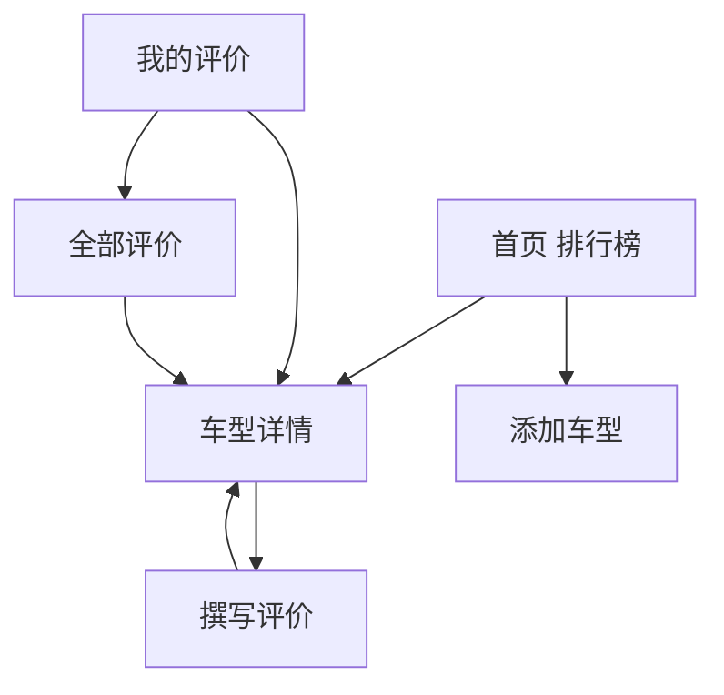

# 车评侦探 UI 优化 PRD

## 1. 文档信息

- 项目名称：车评侦探
- 产品形态：微信小程序
- 当前版本基线：已具备可用功能闭环，进入 UI 统一优化与体验迭代阶段
- 文档目标：为 AI UI 设计师提供完整、可执行的 UI 优化需求说明，用于输出更统一、更成熟、更适合微信小程序的视觉与交互方案

---

## 2. 项目简介

### 2.1 产品定位

车评侦探是一款面向微信生态的车型口碑评分小程序，核心价值是：

- 让用户快速查看热门车型排行榜
- 让用户基于真实用车体验进行五维度评分
- 让用户查看车型口碑、雷达图和评论内容
- 让用户方便地添加新车型并管理自己的评价

### 2.2 核心功能

- 首页排行榜
- 车型详情页
- 五维评分 + 评论发布
- 我的评价管理
- 添加车型
- 品牌/车型联想与纠错辅助

### 2.3 当前技术约束

- 技术栈：微信原生小程序（WXML / WXSS / JS）
- 需遵守微信小程序交互和组件能力边界
- 页面需适配 iPhone 有底部手势区的机型
- 当前功能已跑通，UI 优化应尽量不破坏既有逻辑和数据结构

---

## 3. 用户与核心场景

### 3.1 核心用户

- 准备买车、希望快速看口碑与评分的用户
- 已买车、愿意发布真实评价的车主
- 喜欢浏览榜单、比较车型的汽车兴趣用户

### 3.2 核心使用场景

1. 用户打开首页查看热门车型排行榜
2. 点击某车型进入详情页，查看综合分、各维度表现和评论
3. 进入撰写评价页，完成五维打分并发布评论
4. 在“我的评价”中查看、修改、删除自己的评论
5. 添加新车型时通过联想功能减少误录

---

## 4. 当前页面结构

### 4.1 页面列表

- 首页：`pages/index/index`
- 详情页：`pages/detail/detail`
- 撰写评价页：`pages/writeReview/writeReview`
- 添加车型页：`pages/addCar/addCar`
- 我的评价页：`pages/myReviews/myReviews`
- 全部评价页：`pages/allReviews/allReviews`
- 自定义底部导航：`custom-tab-bar`

### 4.2 主要页面流转

---

## 5. 当前已实现且必须保留的交互能力

以下能力已经开发完成，UI 设计方案必须兼容，不可在设计中忽略：

### 5.1 添加车型页

- 品牌输入支持本地联想
- 品牌确认后，车型输入支持联想
- 车型选择后自动回填：
  - 动力形式
  - 售价区间
- 品牌联想显示在输入框附近
- 车型联想使用更稳定的独立面板，避免 iOS 键盘遮挡

### 5.2 撰写评价页

- 五维评分：
  - 动力三电
  - 操控底盘
  - 空间内饰
  - 辅驾安全
  - 其他体验
- 支持滑块评分
- 支持快捷评分按钮：`50 / 60 / 70 / 80 / 90`
- 底部已有“下一步，撰写评价”按钮
- 评论输入提示词已支持多行换行

### 5.3 详情页

- 展示雷达图
- 展示车型综合分与五维分数
- 展示评论列表
- 允许修改/删除评价

### 5.4 我的评价 / 全部评价

- 支持查看、展开、编辑、删除评价
- 列表中有评分、车型信息、评论摘要

---

## 6. 当前 UI 现状总结

### 6.1 当前设计风格

项目目前采用深色风格，整体基调为：

- 深色页面背景
- 深灰卡片容器
- 橙色主品牌高亮
- 动力类型使用语义色区分

### 6.2 当前颜色基线

当前项目已回到原始主色体系，设计优化应基于此继续完善，而不是推翻重做：

- 页面主背景：`#121212`
- 次级深背景：`#1A1A1A`
- 卡片/输入框背景：`#252525`
- 分割线/边框：`#333333` / `#2A2A2A`
- 主文字：`#FFFFFF`
- 次级文字：`#888888 / #666666 / #AAAAAA`
- 主品牌色：`#FF6B35`
- 主品牌渐变补色：`#FF8C42`
- 高分高亮：`#FFD700`
- 动力类型语义色：
  - 纯电：`#22a568`
  - 增程：`#007eba`
  - 插混：`#c172d4`
  - 燃油：`#ffa200`

### 6.3 当前 UI 的核心问题

#### 全局层面

- 页面间视觉语言不够完全统一
- 同层级文字颜色使用过多，灰阶较散
- 卡片边界、留白、背景层次不够稳定
- 一些页面局部存在“内容缩在内部黑框里”的感受
- 重要交互按钮位置不总是顺手

#### 体验层面

- 小屏真机上，键盘、滚动、底部手势区容易干扰操作
- 评分与输入流程虽然能用，但仍然可以更顺手、更接近成熟产品
- 添加车型页和撰写评价页是当前最需要重点打磨的页面

---

## 7. 本次 UI 优化目标

### 7.1 总目标

在不改变产品核心逻辑的前提下，将 UI 从“开发可用版”提升为“统一、成熟、清晰、适合持续迭代的产品版”。

### 7.2 具体目标

- 统一全局视觉语言
- 优化信息层级与阅读效率
- 改善真机操作体验
- 提升页面间的一致性
- 保持深色风格，但减少粗糙感和“测试版感”

---

## 8. 设计原则

AI UI 设计师需要遵循以下原则：

1. 不推翻产品结构，优先做“统一、拉层级、减噪、提质感”
2. 保持微信小程序环境下的真实可落地性
3. 优先优化高频路径：
   - 首页
   - 详情页
   - 撰写评价页
   - 添加车型页
4. 页面必须兼顾 iPhone 真机体验，尤其是：
   - 键盘弹起时
   - 底部手势区域
   - 小屏幕滚动时
5. 深色风格要稳定、克制，不要过度霓虹化
6. 保持主品牌橙色为核心识别色，但不要过度泛滥

---

## 9. 页面级 UI 优化要求

## 9.1 首页排行榜

### 页面目标

- 让用户快速理解“热门车型排行”
- 强化榜单信息的可扫读性
- 建立品牌感和信任感

### 当前问题

- 前三名强调还不够高级
- 卡片内容层级仍有提升空间
- 分数、标签、车型名之间的节奏可以更清晰

### 设计要求

- 保持榜单卡片式布局
- 前三名可以特殊处理，但要克制，不要廉价霓虹感
- 车型名必须成为第一视觉焦点
- 分数要有辨识度，但不能压过车型信息
- 用户头像堆叠、点评人数、动力标签要更整齐

### 输出重点

- 首页完整高保真稿
- 榜单卡片组件规范
- 前 3 名与普通卡片的统一规则

---

## 9.2 车型详情页

### 页面目标

- 让用户快速理解这台车“值不值得看”
- 在一个页面里完成：
  - 看总分
  - 看维度表现
  - 看用户口碑
  - 去写评价

### 当前问题

- 信息很多，但视觉分组还能更明确
- 各模块边界感还不够统一
- 从“看内容”到“去评价”的动线还可以更自然

### 设计要求

- 头部车型信息区域需要更清晰地表达：
  - 车型名称
  - 动力类型
  - 年款
  - 价格
  - 综合评分
- 雷达图区域需要更容易理解，不要显得“技术实现导向”
- 评论列表要提升可读性，便于快速扫读优缺点
- “写评价 / 修改评价”入口要显眼，但不应过分喧宾夺主

### 输出重点

- 详情页完整高保真稿
- 车型头部信息区规范
- 评论卡片规范

---

## 9.3 撰写评价页

### 页面目标

- 让用户觉得“评分和写评价是轻松的”
- 降低评分负担
- 降低长评论输入压力

### 当前问题

- 页面风格与其他页还不够统一
- 之前局部滚动与整页滚动带来过真机问题，需要特别小心
- 评分区域的层级、留白、顺手度还可以继续优化

### 必须保留的功能

- 五维评分
- 滑块评分
- 快捷评分按钮
- 底部“下一步，撰写评价”按钮
- 两步式流程：评分 -> 写评论

### 设计要求

- 视觉风格需与首页 / 详情页统一
- 评分页不要再有“缩在内层黑框里”的感受
- 顶部、内容、底部 CTA 的结构要清晰
- 快捷评分按钮要清楚、整齐、统一
- 底部 CTA 必须显眼、易点、适合单手操作
- 评论输入区应更像“沉浸式写作页面”，但不能过度复杂

### 真机约束

- 必须考虑 iPhone 底部手势区域
- 必须考虑键盘弹起后的可用性
- 不要设计成依赖复杂嵌套滚动

### 输出重点

- 评分步骤页面高保真稿
- 写评论步骤页面高保真稿
- 快捷评分组件样式规范
- 底部固定 CTA 规范

---

## 9.4 添加车型页

### 页面目标

- 让用户尽可能少输、少犯错
- 让“添加车型”看起来不是后台录入表单，而是产品化入口

### 当前问题

- 视觉上还偏“表单工具页”
- 联想流程虽然功能上已修复，但页面层级还能更精致

### 必须保留的功能

- 品牌联想
- 车型联想
- 自动回填动力形式
- 自动回填售价区间
- 联想结果适配 iOS 真机键盘场景

### 设计要求

- 品牌输入区和车型输入区要成为强视觉重点
- 联想列表要体现“辅助决策”而不是“程序下拉菜单”
- 已识别车型后的回填反馈要更清楚
- 表单信息层级要清晰，避免用户感到录入负担

### 输出重点

- 添加车型页高保真稿
- 品牌联想状态
- 车型联想状态
- 已选车型并自动回填后的状态

---

## 9.5 我的评价 / 全部评价

### 页面目标

- 让用户快速回顾自己的评价历史
- 让用户清楚知道自己可以继续做什么：
  - 看
  - 改
  - 删

### 当前问题

- 信息区块有点散
- 视觉重心不够集中
- 操作按钮可以更清晰

### 设计要求

- 强化“记录感”
- 让评分、车型名、评论摘要关系更清晰
- 编辑/删除操作层级要合理
- 列表应便于连续浏览

### 输出重点

- 我的评价页高保真稿
- 全部评价页高保真稿
- 评价卡片组件规范

---

## 9.6 自定义 TabBar

### 页面目标

- 提升产品识别度
- 让首页 / 我的 / 添加车型三条主路径都足够顺手

### 当前问题

- 已有辨识度，但还可以更精致
- 中间主按钮需要与整体页面更和谐

### 设计要求

- 保留中间凸起按钮的结构
- 保证激活态清晰
- 保证与整体深色主题一致
- 要考虑 iPhone 底部安全区

---

## 10. 组件级设计要求

设计师需要沉淀一套统一组件规范，至少包括：

- 页面头部 Header
- 榜单卡片
- 车型信息头部卡片
- 评论卡片
- 输入框
- 联想下拉 / 联想面板
- 动力类型标签
- 评分滑块区
- 快捷评分按钮
- 主按钮 / 次按钮 / 危险按钮
- 底部固定 CTA
- 空状态 / 加载状态
- 弹窗 / 模态框

每个组件至少需要说明：

- 默认态
- 点击态 / 激活态
- 禁用态
- 小屏适配方式

---

## 11. 字体、间距、边框建议

建议设计师统一出一套基础规范：

### 字体层级

- 页面主标题
- 区块标题
- 车型名 / 核心信息
- 正文
- 次级说明
- 标签 / 辅助信息

### 间距体系

- 4 / 8 / 12 / 16 / 20 / 24 / 32

### 圆角体系

- 输入框
- 卡片
- 小标签
- 按钮

### 边框体系

- 一级边框
- 分割线
- 弱边框

---

## 12. 交付物要求

请 AI UI 设计师输出以下内容：

### 12.1 必交付

- 全局视觉方向说明
- 全局色板
- 字体层级规范
- 间距规范
- 按钮 / 卡片 / 输入框 / 标签组件规范
- 首页高保真稿
- 详情页高保真稿
- 撰写评价页（评分步骤 + 写评论步骤）高保真稿
- 添加车型页高保真稿
- 我的评价页高保真稿
- TabBar 高保真稿

### 12.2 建议补充

- 空状态
- 加载状态
- 联想列表状态
- 弹窗状态
- 真机尺寸适配说明
- UI 变量命名建议（design token）

---

## 13. 验收标准

设计稿需要满足以下标准：

1. 与现有产品功能完全兼容
2. 页面风格明显更统一
3. 真机体验优先，特别是 iPhone
4. 主要操作更顺手，减少大幅度手指移动
5. 页面不再有“测试版 / 开发版 / 缩在黑框里”的感觉
6. 首页、详情、写评价、添加车型四个页面形成统一视觉语言

---

## 14. 非目标

本次 PRD 主要面向 UI 与交互优化，不要求：

- 重构数据库
- 修改核心业务规则
- 接入新的大模型能力
- 大规模改动页面信息架构

除非设计确实需要，否则不建议增加新的复杂流程。

---

## 15. 给 AI UI 设计师的明确任务

请基于本 PRD，对“车评侦探”小程序做一轮**偏成熟产品化、深色风格、微信小程序可落地**的 UI 优化设计。

设计时请特别注意：

- 统一风格，不要给每个页面设计成不同产品
- 保持深色主题
- 保留主品牌橙色系统
- 优先优化高频页面和高频交互
- 把真机使用体验放在第一优先级

如果需要一句话概括本次设计任务：

**把一个已经功能可用的车评小程序，升级成一套更统一、更成熟、更适合真机长期使用的产品界面。**

